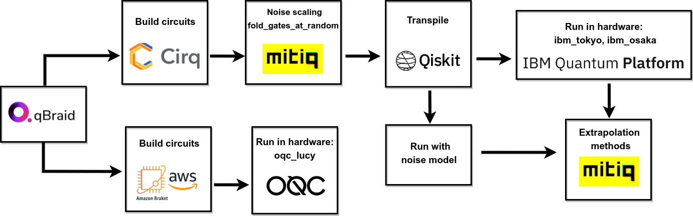

# Simulating open quantum systems with qbraid-SDK

During the Quantum Computing Mentorship Program from the Quantum Open Source Foundation, which connects people from diverse backgrounds with mentors from academia and industry, we had access to the Qbraid services. The project goal was to understand how to simulate open quantum systems using gate-based quantum computing. Using as a guide the previous work by García-Pérez, et al. [npj Quantum Information 6.1 (2020): 1].

We did simulations of two Open Quantum System models, Collisional and Markovian Reservoir, with noise simulations on the IBM devices (ibmq_kyoto, ibmq_osaka) and the OQC device Lucy. Extending on previous results. Using the Mitiq toolkit, we apply Zero-Noise extrapolation (ZNE), an error mitigation technique, and analyze their deviation from the theoretical results for the models under study. For both models, by applying ZNE, we reduced the error and overlapped it with the theoretical results. 

One of the main hassles of working on this type of project is the different frameworks necessary to run the simulations and in real QPU. We used Mitiq, Qiskit, Cirq, and AWS bracket in this project. Since Mitiq is based on Cirq, it is better to work directly with it and use Mitiq's noise scaling methods. Then, to run in the IBM QPUs, the circuits must be transpiled to Qiskit. We can do this by passing the Cirq circuits to QASM and then to Qiskit to use the transpile method. Finally, to run the circuits in Lucy from OQC, AWS braket must be used. Given the gate basis for the hardware and topology, the circuit will increase in depth.

The use of multiple frameworks can complicate the actual applications that we want to explore with quantum computing. Using the QBraid-SDK environment, a Python toolkit for cross-framework abstraction, transpilation, and execution of quantum programs on hardware and simulators, facilitated the implementation of multiple quantum frameworks. Also, it facilitates the connection with AWS quantum services.

